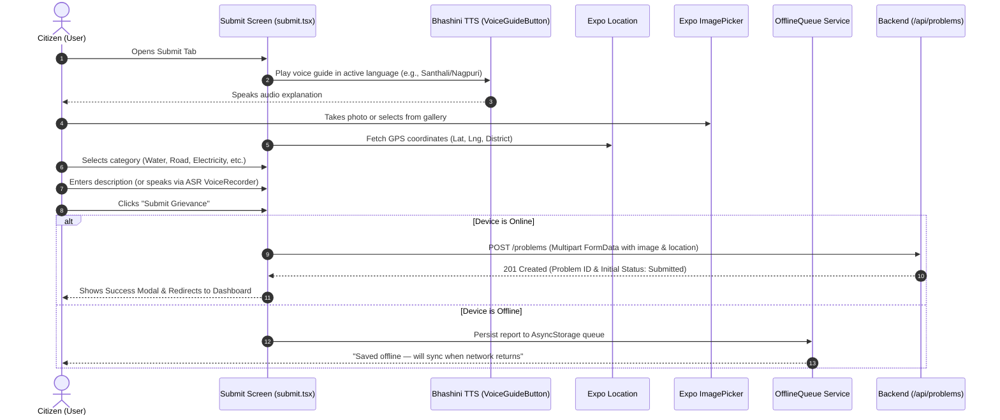
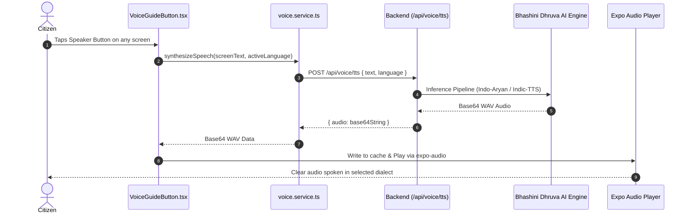

# Samadhan Setu (समाधान सेतु) — Complete Architecture, Workflows & Component Reference

> **AI Assistant Reference Document (for Claude AI & Agentic Coders)**  
> **App:** `App/Samadhan_Setu_App`  
> **Framework:** React Native (Expo SDK 57 / Expo Router v4 / React 18)  
> **Language:** TypeScript  
> **Target OS:** Android & iOS (Offline-first, Bhashini AI-driven Civic Grievance Platform for Jharkhand)

---

## 1. System Architecture Overview

```
+-----------------------------------------------------------------------------------+
|                            CITIZEN MOBILE APPLICATION                             |
|                           (React Native / Expo SDK 57)                            |
+-----------------------------------------------------------------------------------+
       |                           |                           |            |
       v                           v                           v            v
+---------------+          +---------------+          +---------------+  +----------+
|  Expo Router  |          | Zustand Store |          | i18next Multi |  | Offline  |
|  (File-based) |          | (App, Auth,   |          | Language (12  |  | Queue    |
|  10 Screens   |          |  Problems)    |          | Dialects)     |  | Storage  |
+---------------+          +---------------+          +---------------+  +----------+
       |                           |                           |            |
       +---------------------------+---------------------------+------------+
                                   |
                                   v
             +-------------------------------------------+
             |         Core Service Layer (Axios)        |
             |  • api.ts (JWT interceptors & tokens)     |
             |  • auth.service.ts (Login / Register)     |
             |  • problem.service.ts (Multipart Reports) |
             |  • voice.service.ts (Bhashini TTS / ASR)  |
             |  • socket.service.ts (Real-time events)   |
             +-------------------------------------------+
                                   |
                                   v  (REST / WebSocket)
+-----------------------------------------------------------------------------------+
|                        BACKEND API & BHASHINI PIPELINE                            |
|             (Express.js / MongoDB / MeitY Bhashini AI / Socket.io)                |
+-----------------------------------------------------------------------------------+
```

---

## 2. Complete End-to-End User Workflows

### 2.1 Citizen Grievance Reporting Workflow



### 2.2 Multi-Language Voice Guidance Workflow



---

## 3. Screen-by-Screen Directory & Component Breakdown

The application contains **10 primary screens** organized using Expo Router file-based navigation.

```
app/
├── _layout.tsx                     # Global App Shell, Providers, Theme & Auth check
├── index.tsx                       # Screen 1: Welcome & Splash Landing Page
├── register.tsx                    # Screen 2: Citizen Registration
├── login.tsx                       # Screen 3: Citizen Login & OTP Gate
└── (tabs)/
    ├── _layout.tsx                 # Bottom Tab Bar (Navigation Icons & Styles)
    ├── dashboard.tsx               # Screen 4: Citizen Central Dashboard
    ├── submit.tsx                  # Screen 5: Grievance Reporting Form
    ├── analytics.tsx               # Screen 6: Civic Analytics & District Stats
    ├── notifications.tsx           # Screen 7: Notification Feed
    ├── profile.tsx                 # Screen 8: User Profile & 12-Language Selector
    └── problems/
        ├── _layout.tsx             # Problems Stack Header Config
        ├── index.tsx               # Screen 9: Public Problem Feed & Search
        └── [id].tsx                # Screen 10: Problem Detail, Timeline & Upvoting
```

---

### Screen 1: Welcome / Landing Page (`app/index.tsx`)
- **Route:** `/`
- **Purpose:** First impression for citizens. Welcomes users in their language, showcases civic statistics, and provides paths for immediate grievance reporting, registration, or guest browsing.
- **Key Components:**
  - `SamadhanHeader`: Top navigation brand bar with logo and language cycling pill.
  - `VoiceGuideButton`: Floating speaker button speaking `t('home.voiceGuide')`.
  - `Button`: Primary CTAs ("शिकायत दर्ज करें" / Start Report, "लॉगिन करें" / Sign In).
  - Background Image: Tribal-inspired background illustration (`assets/home_bg_v2.jpg`).
  - Statistics Badges: Displays real-time counts of total complaints submitted vs resolved.
- **Stores & Hooks Used:** `useAppStore` (language), `useAuthStore` (session check), `useTranslation`.

---

### Screen 2: Citizen Registration (`app/register.tsx`)
- **Route:** `/register`
- **Purpose:** Onboarding for citizens with low digital literacy. Collects name, 10-digit mobile number, district, and secure PIN/password.
- **Key Components:**
  - `SamadhanHeader`: Includes back button to return to Welcome screen.
  - `VoiceGuideButton`: Speaks `t('register.voiceGuide')` explaining required fields.
  - `Input`: Clean formatted fields with numeric keyboard for mobile number.
  - District Picker: Selects from Jharkhand's 24 districts (Ranchi, Dhanbad, Bokaro, etc.).
  - `Button`: Submit registration with loading spinner state.
  - Link to `/login` for existing users.
- **API Call:** `authService.register({ full_name, phone, district, password })`.

---

### Screen 3: Citizen Login & Authentication (`app/login.tsx`)
- **Route:** `/login`
- **Purpose:** Fast sign-in for returning citizens. Supports Password authentication, OTP fallback, and an instant "Guest Mode" for urgent reports.
- **Key Components:**
  - `SamadhanHeader`: Standard navigation.
  - `VoiceGuideButton`: Speaks `t('login.voiceGuide')`.
  - `Input`: Phone/email and password fields with visibility toggle.
  - `Button`: Primary login trigger.
  - "अतिथि के रूप में जारी रखें" (Continue as Guest) button: Bypasses auth gate and sets guest flag in `authStore`.
- **API Call:** `authService.login({ phone, password })`. Persists JWT token in `expo-secure-store`.

---

### Screen 4: Citizen Central Dashboard (`app/(tabs)/dashboard.tsx`)
- **Route:** `/(tabs)/dashboard`
- **Purpose:** Personal command center for citizens to track their submitted grievances, monitor resolution progress, and initiate new reports.
- **Key Components:**
  - `VoiceGuideButton`: Speaks `t('dashboard.voiceGuide')`.
  - Stats Summary Row (`Card`): Total complaints, In Progress, Resolved counters.
  - Complaints List (`FlatList`): Renders cards for each problem submitted by the logged-in user.
  - `StatusBadge`: Color-coded indicator (`Submitted`, `Verified`, `In Progress`, `Resolved`).
  - `EmptyState`: Friendly Sohrai-themed illustration when no complaints exist yet.
  - Floating Action Button (FAB): Direct shortcut to `/(tabs)/submit`.
- **Stores & Hooks:** `useProblemStore` (`fetchUserProblems`), `useAuthStore`.

---

### Screen 5: Grievance Submission Wizard (`app/(tabs)/submit.tsx`)
- **Route:** `/(tabs)/submit`
- **Purpose:** The core function of the app. Enables citizens to document and file civic issues (potholes, broken water pipes, illegal dumping, power outages).
- **Key Components:**
  - `VoiceGuideButton`: Speaks step-by-step instructions (`t('submit.voiceGuide')`).
  - Image Capture Module: Camera and Gallery options using `expo-image-picker`. Displays photo preview thumbnails with remove button.
  - `CategoryGrid`: 8 visual civic categories with icons (Water, Road, Health, Electricity, School, Sanitation, Environment, Emergency).
  - Description Input: Multi-line text field for problem details.
  - `VoiceRecorder`: Audio recording component enabling non-literate citizens to speak their problem; converts speech to text via Bhashini ASR.
  - Location Module: Automatic GPS capture via `expo-location` with district fallback.
  - `Button`: "शिकायत भेजें" (Submit) with multipart form data dispatch.
- **Offline Resilience:** If device is offline, automatically saves payload to `offlineQueue.service.ts` and syncs on network recovery.

---

### Screen 6: Public Problem Feed & Search (`app/(tabs)/problems/index.tsx`)
- **Route:** `/(tabs)/problems`
- **Purpose:** Community transparency feed displaying all verified civic issues reported across Jharkhand. Citizens can view local issues and upvote/support them.
- **Key Components:**
  - Search Input: Real-time search across complaint titles, descriptions, and districts.
  - Category Filter Pills: Horizontal scroll list to filter by civic category.
  - District Selector: Dropdown to view problems in a specific district.
  - Problem Cards: Shows photo thumbnail, category tag, location address, relative time, and upvote/support counter.
  - `StatusBadge`: Live status indicator.
  - Pull-to-Refresh: Refetches latest problem feed from backend.
- **API Call:** `problemService.getProblems({ category, district, search })`.

---

### Screen 7: Problem Details, Timeline & Upvote (`app/(tabs)/problems/[id].tsx`)
- **Route:** `/(tabs)/problems/[id]`
- **Purpose:** Comprehensive view of a single problem, its chronological resolution timeline, assigned department, and community endorsements.
- **Key Components:**
  - `VoiceGuideButton`: Speaks `t('problemDetail.voiceGuide')`.
  - Photo Carousel: High-resolution complaint photo and "After Resolution" proof photos.
  - `SohraiBorderHeader`: Decorative ethnic header framing problem title and category.
  - `StatusBadge` & `TrustBadge`: AI trust score and verification badge.
  - Chronological Timeline: 4-stage stepper (Reported -> Verified by AI/Authority -> Assigned to Department -> Resolved).
  - Department Assignment Card: Shows responsible municipal body (e.g., "Ranchi Municipal Corporation - Water Works").
  - Community Support/Upvote Button: Allows citizens to endorse the problem to raise municipal priority.
- **API Calls:** `problemService.getProblemById(id)`, `problemService.upvoteProblem(id)`.

---

### Screen 8: Civic Analytics & District Stats (`app/(tabs)/analytics.tsx`)
- **Route:** `/(tabs)/analytics`
- **Purpose:** Government accountability and civic metrics. Gives citizens visual proof of resolution rates and municipal performance.
- **Key Components:**
  - `VoiceGuideButton`: Speaks `t('analytics.voiceGuide')`.
  - District Filter Dropdown: Select specific district or view Jharkhand statewide stats.
  - Monthly Metric Cards: "This Month Reports" vs "Resolved Reports".
  - Category Breakdown Chart: Visual distribution of grievances by sector.
  - `SohraiTreeIllustration`: Ethnic Jharkhand motif rendering empty/loading states.
- **Stores & Hooks:** `useProblemStore`, `useTranslation`.

---

### Screen 9: Notification Feed (`app/(tabs)/notifications.tsx`)
- **Route:** `/(tabs)/notifications`
- **Purpose:** Real-time push update center informing citizens whenever their reported problem is acknowledged, assigned, or resolved.
- **Key Components:**
  - `VoiceGuideButton`: Speaks `t('notifications.voiceGuide')`.
  - Notification List: Cards with icon, status badge, timestamp, and unread marker.
  - "Mark All as Read" action button.
  - `SohraiBellEmpty`: Illustrated state when citizen has no unread alerts.
- **Integration:** Powered by `socket.service.ts` for instant live notifications.

---

### Screen 10: Profile & 12-Language Selector (`app/(tabs)/profile.tsx`)
- **Route:** `/(tabs)/profile`
- **Purpose:** Account management, citizen settings, and the multi-lingual accessibility hub.
- **Key Components:**
  - User Details Card: Full name, phone number, registered district.
  - Edit Profile Modal / Form.
  - **Language Selection Grid (`langGrid`):** 2-column responsive grid containing all 12 supported Jharkhand languages:
    1. **Hindi (`hi`)** — हिंदी
    2. **English (`en`)** — English
    3. **Santhali (`sat`)** — ᱥᱟᱱᱛᱟᱲᱤ
    4. **Khortha (`kht`)** — खोरठा
    5. **Nagpuri (`nag`)** — नागपुरी
    6. **Bhojpuri (`bho`)** — भोजपुरी
    7. **Angika (`anp`)** — अंगिका
    8. **Magahi (`mag`)** — मगही
    9. **Maithili (`mai`)** — मैथिली
    10. **Kurukh (`kru`)** — कुड़ुख़
    11. **Odia (`or`)** — ଓଡ଼ିଆ
    12. **Bengali (`bn`)** — বাংলা
  - **Voice Guide Toggle:** Switch to turn automated voice guides ON or OFF globally.
  - Community Referral Share: Generates shareable app link for villagers and neighbors.
  - Logout Button: Clears SecureStore session and returns to Welcome screen.

---

## 4. Reusable Common Components Reference (`src/components/common/`)

| Component | File Path | Props & Description |
| :--- | :--- | :--- |
| **`SamadhanHeader`** | `SamadhanHeader.tsx` | App-wide top bar. Contains official branding, back button, and language pill (`LANG_DISPLAY`) that cycles through languages on tap. |
| **`VoiceGuideButton`** | `VoiceGuideButton.tsx` | Floating or inline audio button. Takes `text: string`. Synthesizes speech via Bhashini TTS API using `expo-audio` with `expo-speech` fallback. |
| **`VoiceRecorder`** | `VoiceRecorder.tsx` | Records voice audio from citizen microphone and sends base64 audio to Bhashini ASR for speech-to-text. |
| **`Button`** | `Button.tsx` | Styled button supporting variants: `primary`, `secondary`, `outline`, `ghost`. Supports leading icon, loading spinner, disabled states. |
| **`Card`** | `Card.tsx` | Elevated container with subtle Sohrai earth-toned border and background elevation. |
| **`Input`** | `Input.tsx` | Accessible text input with label, error text, helper text, and left/right icon slots. |
| **`StatusBadge`** | `StatusBadge.tsx` | Color-coded status badge for complaint lifecycles: `SUBMITTED` (orange), `VERIFIED` (blue), `IN_PROGRESS` (purple), `RESOLVED` (green), `DISPUTED` (red). |
| **`TrustBadge`** | `TrustBadge.tsx` | Renders AI verification confidence score or Official Verification seal. |
| **`CategoryGrid`** | `CategoryGrid.tsx` | 2x4 grid displaying civic categories with custom vector icons and bilingual labels. |
| **`OfflineBanner`** | `OfflineBanner.tsx` | Appears at the top of screens when device loses network connectivity. |
| **`EmptyState`** | `EmptyState.tsx` | Clean illustrated placeholder with title, description, and action button for empty lists. |
| **`ProgressDots`** | `ProgressDots.tsx` | Visual indicator for multi-step wizards or onboarding carousels. |
| **Sohrai Art Motifs** | `SohraiBorderHeader.tsx`, `SohraiBorderFull.tsx`, `SohraiCardCorner.tsx`, `SohraiTreeIllustration.tsx`, `SohraiBellEmpty.tsx` | Handcrafted SVG motifs celebrating Jharkhand's indigenous Sohrai wall painting heritage. |

---

## 5. State Management & Store Architecture (`src/store/`)

All global client state is managed through lightweight **Zustand** stores:

```
src/store/
├── appStore.ts             # Language, voice guide toggle, network status
├── authStore.ts            # User profile, JWT token, guest status
├── problemStore.ts         # Complaint lists, active filters, selected problem
└── notificationStore.ts    # Unread counter, incoming push notifications
```

- **`useAppStore`:**
  - `language`: Current active language code (`'hi' | 'en' | 'sat' | 'kht' | 'nag' | 'bho' | 'anp' | 'mag' | 'mai' | 'or' | 'bn' | 'kru'`).
  - `isVoiceGuideEnabled`: Boolean to enable/mute voice buttons.
  - `isSpeaking`: Boolean indicating if audio playback is currently in progress.
  - `isOffline`: Boolean tracking device connectivity.
- **`useAuthStore`:**
  - `user`: Citizen details (`id`, `full_name`, `phone`, `district`).
  - `token`: JWT authentication string (stored securely in `expo-secure-store`).
  - `isAuthenticated`: Boolean session flag.
  - `isGuest`: Boolean for unauthenticated exploration.
- **`useProblemStore`:**
  - `problems`: Feed of all civic issues.
  - `myProblems`: Complaints filed by the current citizen.
  - `filters`: Active category, district, and search parameters.

---

## 6. Services & Network Layer (`src/services/`)

1. **`api.ts`:**
   - Axios client instance with configured `baseURL` from `process.env.EXPO_PUBLIC_API_URL`.
   - Automatic `Authorization: Bearer <token>` request interceptor reading from SecureStore.
   - Response interceptor for unified error formatting.
2. **`problem.service.ts`:**
   - Handles multipart/form-data for image uploads alongside JSON fields.
   - Fallback to JSON payload when submitting remote URLs.
   - Methods: `createProblem`, `getProblems`, `getProblemById`, `getUserProblems`, `upvoteProblem`.
3. **`voice.service.ts`:**
   - `resolveVoiceLanguage(lang)`: Maps friendly dialect names to Bhashini language codes.
   - `synthesizeSpeech(text, lang)`: Dispatches POST `/api/voice/tts` and returns base64 WAV string.
   - `transcribeAudio(base64, lang)`: Dispatches POST `/api/voice/asr` and returns transcribed text.
4. **`offlineQueue.service.ts`:**
   - Intercepts failed network requests when `NetInfo.isConnected === false`.
   - Stores pending complaints in local storage.
   - Automatically replays queue when device reconnects.
5. **`socket.service.ts`:**
   - WebSocket client listening to problem status updates (`problem:updated`, `notification:new`).

---

## 7. Indigenous Design System & Theme (`src/theme/`)

The design system is grounded in **Jharkhand's Sohrai Tribal Art**, using earthy mineral tones instead of generic app colors:

```typescript
// src/theme/colors.ts
export const colors = {
  forestGreen: '#1E4B3E',    // Deep Sal forest green (Primary brand)
  terracotta:  '#9E3C1B',    // Fired clay / red soil (Secondary / Action)
  mudBrown:    '#4A3B32',    // Natural wall mud (Text & Borders)
  mustard:     '#D49B28',    // Mustard flower / harvest (Accent / Highlight)
  chuna:       '#F8F5EE',    // Lime-washed white plaster (Card backgrounds)
  surface:     '#FFFFFF',    // Pure surface white
  borderLight: '#E8DFD0',    // Subtle earthen divider
  sindoor:     '#C8382B',    // Alert / Emergency red
  success:     '#2E7D32',    // Resolved green
};
```

---

## 8. Internationalization (`src/utils/i18n.ts` & `src/utils/locales/`)

The application supports **12 complete languages**. Each JSON locale file contains identical keys organized by screen:
- `common`: Generic words (`appName`, `loading`, `save`, `cancel`, `submit`, `error`).
- `home`: Landing titles, counter labels, `voiceGuide`.
- `register`: Field labels, placeholders, `voiceGuide`.
- `login`: Input prompts, guest mode text, `voiceGuide`.
- `dashboard`: Stat titles, card headers, `voiceGuide`.
- `submit`: Photo picker labels, category headers, `voiceGuide`.
- `problemDetail`: Status timeline labels, officer info, `voiceGuide`.
- `problems`: Filter titles, search placeholders, `voiceGuide`.
- `analytics`: District analytics labels, `voiceGuide`.
- `notifications`: Empty state texts, mark all read, `voiceGuide`.
- `profile`: Profile fields, language names, `voiceGuide`.

> **Note on Santhali (`sat.json`):** Santhali is written phonetically in Devanagari script so Bhashini’s Indo-Aryan speech synthesis model pronounces full, natural sentences without phonetic dropouts.

---

## 9. Running & Developing the App

```bash
# Navigate to app directory
cd App/Samadhan_Setu_App

# Install dependencies
npm install

# Type-check code
npx tsc --noEmit

# Start Metro development server with clear cache
npx expo start -c
```
